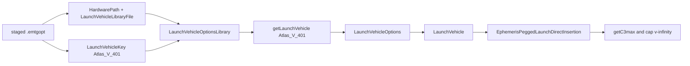

# IPOPT Baselining Decision Log

This is a manual review record. Baselining evidence is replaceable; immutable SNOPT source pairs remain under `testatron/tests`. Promotion requires stable `matched_snopt` evidence, acceptable replay and refinement, and a reviewer approval recorded here.

## Review Template

| Field | Record |
| --- | --- |
| Case number and ID | |
| Immutable options SHA-256 | |
| Immutable SNOPT mission SHA-256 | |
| Evidence directory | |
| Attempt classifications | |
| Repeatability | |
| Replay result | |
| Refinement result | |
| Manual decision | `approve`, `reject`, or `defer` |
| Rationale / next action | |
| Promotion | Not attempted / command and curated path |

## 1. `global_mission_options/globalmissionoptions_MGALT_DLAbounds`

| Field                           | Record                                                                                                                                                                                      |
| ------------------------------- | ------------------------------------------------------------------------------------------------------------------------------------------------------------------------------------------- |
| Case number and ID              | 1; `global_mission_options/globalmissionoptions_MGALT_DLAbounds`                                                                                                                            |
| Immutable options SHA-256       | `878e84e922ef6d9d61a73105ce8ff2828189b5e6262a74e17952d6bc73f0a050`                                                                                                                          |
| Immutable SNOPT mission SHA-256 | `8770d6cbe186dcabdbb1d7b6a9ca1ff2d6938fcf53460e6ce12cee7eb8b75a13`                                                                                                                          |
| Evidence directory              | `testatron/ipopt/tests/tests/baselining/global_mission_options/globalmissionoptions_MGALT_DLAbounds/`                                                                                       |
| Attempt classifications         | Attempt 1: `mismatch_snopt`; attempt 2: `mismatch_snopt`                                                                                                                                    |
| Repeatability                   | Stable; no reported differences                                                                                                                                                             |
| Replay result                   | Unacceptable: deterministic delta-v and journey endpoints differ; objective, topology, schema, flight time, and final mass agree. Maximum endpoint position delta: `107.25168052315712 km`. |
| Refinement result               | Not run; replay gate blocked refinement.                                                                                                                                                    |
| Manual decision                 | `defer`                                                                                                                                                                                     |
| Rationale / next action         | Investigate the shared replay discrepancy without changing immutable inputs, tolerances, or promotion state.                                                                                |
| Promotion                       | Not attempted; ineligible while classified `mismatch_snopt`.                                                                                                                                |

Yes. The current staged replay selects this non-v2 library:

```text
docs/0_Users/tutorial/Tutorial_EMTG_Files/Config_Files/hardware_models/
  LaunchVehicles_PubliclyDistributable_NLSII.emtg_launchvehicleopt
```

and writes:

```text
LaunchVehicleLibraryFile LaunchVehicles_PubliclyDistributable_NLSII.emtg_launchvehicleopt
LaunchVehicleKey Atlas_V_401
```

into the staged `.emtgopt`.

`LaunchVehicles_PubliclyDistributable_NLSII_v2.emtg_launchvehicleopt` is a separate, tracked library variant. It is **not currently selected** by the baselining staging code. From the content shown, it contains the same `Atlas_V_401` record, plus at least the additional `Falcon_9_FT_(RTLS)_CoastPhase_Test` entry. We should not switch to v2 merely to test a different file because it does not change the Atlas record.

The lookup chain is:



Concretely:

1. The staged options provide:
   - `HardwarePath`
   - `LaunchVehicleLibraryFile`
   - `LaunchVehicleKey Atlas_V_401`

2. `LaunchVehicleOptionsFactory.cpp` loads:

   ```cpp
   options.HardwarePath + "/" + options.LaunchVehicleLibraryFile
   ```

3. `LaunchVehicleOptions.cpp` parses the Atlas row as:

   ```text
   name       = Atlas_V_401
   model type = 0
   DLA        = [-28.5, 28.5] degrees
   C3         = [0, 60]
   adapter    = 0.0 kg
   coefficients = remaining polynomial values
   ```

4. The factory calls:

   ```cpp
   getLaunchVehicle(options.LaunchVehicleKey)
   ```

   which should return that Atlas record.

5. EMTG constructs a `LaunchVehicle` from it.

6. `EphemerisPeggedLaunchDirectInsertion.cpp` applies:

   ```cpp
   v_infinity_upper_bound = min(
       journey.initial_impulse_bounds[1],
       sqrt(launch_vehicle.C3max)
   )
   ```

For Atlas V 401, that means:

$$
\sqrt{60} = 7.745966692\ \text{km/s}
$$

The journey bound is $6.97\ \text{km/s}$, so the final expected upper bound is:

$$
\min(6.97,\ 7.745966692) = 6.97\ \text{km/s}
$$

But the generated mission reports $3.162277660$, which is:

$$
\sqrt{10}
$$

That is the Falcon C3 cap. Therefore the diagnostic question is exact: **where between the staged `Atlas_V_401` declaration and the boundary-event `getC3max()` does Falcon enter the actual run?**

I’ll trace the native object flow from `EMTG_v9` through mission construction and search every assignment to the launch-vehicle options/key. The local hypothesis is that the staged `Atlas_V_401` reaches the parser but a second mission-construction path replaces or caps it before the departure boundary is built.

Searched for regex `LaunchVehicleOptions|myLaunchVehicle|setC3|CreateLaunchVehicleOptions` (`**/src/Mission/**`), 82 results

Searched for regex `LaunchVehicleKey\s*=|LaunchVehicleLibraryFile\s*=|setC3_upperbound|setC3_lowerbound` (`**/src/**`), 14 results

Searched for regex `Mission\(` (`**/src/Mission/**`), 10 results

Read , lines 680 to 750

Static tracing is complete: in the current source there is no assignment that changes `LaunchVehicleKey` after `missionoptions` parses the staged file. The mission constructor receives the one `LaunchVehicle` built by the factory, and the departure boundary reads that object’s C3 maximum directly. I’ll now summarize the exact remaining runtime checks, because the source path itself does not explain Falcon entering the run.

Static code tracing says there is **no Falcon fallback after parsing**.

The native path is:

1. EMTG parses the staged `.emtgopt`.
2. It reads:

   ```text
   HardwarePath /repo/docs/.../hardware_models
   LaunchVehicleLibraryFile LaunchVehicles_PubliclyDistributable_NLSII.emtg_launchvehicleopt
   LaunchVehicleKey Atlas_V_401
   ```

3. `LaunchVehicleOptionsFactory.cpp` creates:

   ```cpp
   LaunchVehicleOptionsLibrary(
       options.HardwarePath + "/" + options.LaunchVehicleLibraryFile
   ).getLaunchVehicle(options.LaunchVehicleKey)
   ```

4. `EMTG_v9.cpp` constructs one `LaunchVehicle` from that result and passes it into `Mission`.
5. `mission.cpp` copies that same object into every journey.
6. `EphemerisPeggedLaunchDirectInsertion.cpp` reads its `getC3max()` directly.

There is no later assignment to either `LaunchVehicleKey`, `LaunchVehicleLibraryFile`, or the C3 bounds in production mission code.

Therefore, if the staged file really is the file the executable reads, the expected bound is:

$$
\min(6.97,\sqrt{60}) = 6.97\ \text{km/s}
$$

not $\sqrt{10}=3.16227766$.

So Falcon is not entering through a visible source-code handoff. The remaining possibilities are runtime evidence issues:

1. `/repo/docs/.../LaunchVehicles_PubliclyDistributable_NLSII.emtg_launchvehicleopt` inside Docker is not the same file inspected on the host.
2. `/build/src/EMTGv9` is not the executable built from the currently inspected source.
3. The generated `.emtg` was not produced from the staged `.emtgopt` whose contents we inspected.
4. An unobserved runtime parse/load failure causes EMTG to use a different configuration.

The immediate no-edit diagnostic is to compare the exact staged-option hash and the exact library hash **inside the same container** that runs EMTG, then record which paths it opens. Do not change Atlas, v2, or any hardware coefficients until that confirms the executable’s actual inputs.

---

## 2. `global_mission_options/globalmissionoptions_MGALT_RLAbounds`

| Field                           | Record                                                                                                                                                                                                                           |
| ------------------------------- | -------------------------------------------------------------------------------------------------------------------------------------------------------------------------------------------------------------------------------- |
| Case number and ID              | 2; `global_mission_options/globalmissionoptions_MGALT_RLAbounds`                                                                                                                                                                 |
| Immutable options SHA-256       | `cd16f3e4927c1f876162ab88c4c99135a1df73b0d2fa51cf69ffe94adb762f5e`                                                                                                                                                               |
| Immutable SNOPT mission SHA-256 | `789da17e75652573ccde60e67fcb8e22171b8ba40abdf2d8c639ef3d6fbe5149`                                                                                                                                                               |
| Evidence directory              | `testatron/ipopt/tests/tests/baselining/global_mission_options/globalmissionoptions_MGALT_RLAbounds/`                                                                                                                            |
| Attempt classifications         | Attempt 1: `mismatch_snopt`; attempt 2: `mismatch_snopt`                                                                                                                                                                         |
| Repeatability                   | Stable; no reported differences                                                                                                                                                                                                  |
| Replay result                   | Unacceptable: identical failure pattern to case 1. Deterministic delta-v and journey endpoints differ; objective, topology, schema, flight time, and final mass agree. Maximum endpoint position delta: `107.25168052315712 km`. |
| Refinement result               | Not run; replay gate blocked refinement.                                                                                                                                                                                         |
| Manual decision                 | `defer`                                                                                                                                                                                                                          |
| Rationale / next action         | Treat as corroborating evidence of a shared replay discrepancy; continue ordered cases before changing staging or resources.                                                                                                     |
| Promotion                       | Not attempted; ineligible while classified `mismatch_snopt`.                                                                                                                                                                     |

## Case 1 through 5 and most likely 1 through 28

I’ll verify the five case-level results and compare their replay signatures. If they are identical, that strongly points to a shared staging/runtime condition rather than any individual global-option variation.

All five are stable `mismatch_snopt` results with the same two failed replay checks: `total_deterministic_deltav` and `journey_endpoints`. The option-specific objectives vary as expected, but the endpoint displacement remains effectively constant at about 107.25165 km, so this is shared behavior.

Confirmed. All five have the same structural replay failure:

- Both attempts are stable `mismatch_snopt`.
- `journey_names`, topology, decision schema/vector length, objective, flight time, and final mass pass.
- Only `total_deterministic_deltav` and `journey_endpoints` fail.
- Refinement is correctly blocked for all five.

The maximum endpoint position delta is effectively constant:

- Cases 1-2: `107.251680523 km`
- Cases 3-4: `107.251669198 km`
- Case 5: `107.251643538 km`

That variation is negligible relative to the 1 km threshold and strongly indicates one shared replay/staging/runtime cause, not a defect in individual DLA, RLA, dry-mass, final-mass, or initial-impulse options. No promotion is eligible.

---

# 29. `journey_options/AerodynamicDrag_EarthOrbit_Maneuver`

passed. 
Had to run 850 ish iterations.

# 30. 'journey_options/EME_stageAfterArrival'

Same position 107 or km error as the `global_mission_options` + weight

---

